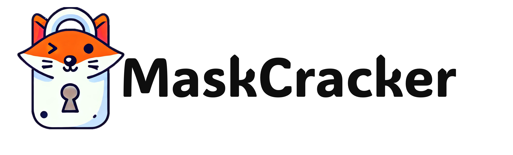

<div align="center">

</div>
<p align="left">
  <a href="./README_en.md">English Version Here</a> 
</p>

你的 metamask 钱包安全吗？这是一个测试工具，MaskCracker 可以测试
1. 当你的浏览器中所有网站密码泄漏，你的钱包是否安全。
2. 当你被钓鱼运行了恶意代码，你的钱包是否会被破解。

工作原理：
MaskCracker可以导出你的chrome浏览器密码，随后可以使用这些密码，使用大模型或者深度学习推测你的密码结构，生成最有可能的密码字典，使用世界上最快的密码破解工具 hashcat，来破解你的助记词或者私钥。并且还提供了过去泄漏的密码库，可以直接使用这些密码库。

> 免责声明：本工具仅用于安全研究，因使用本工具而产生的一切法律及相关责任由用户自行承担，原作者不承担任何法律责任。


## 安装

该项目使用 Poetry 进行依赖管理，可参考[安装教程](https://python-poetry.org/docs/)。
要安装依赖，请确保已安装 Poetry，然后运行：

```bash
poetry install
```

> 如果只想使用打印 chrome 密码和使用密码解密metamask功能，可以不安装 hashcat。

由于 hashcat 在处理metamask的模块已经过时，可以使用我 fork 的 [hashcat](https://github.com/learnerLj/hashcat)。读者可以在 [Releases](https://github.com/learnerLj/hashcat/releases/tag/fix-version) 中下载修复的版本 `hashcat-fix-metamask.tar.gz`，里面包含macos的 `hashcat` 和交叉编译用于windows的 `hashcat.exe`。读者也可参考 `BUILD*.md` 自行编译。

解压到仓库根目录。
如果是macos，直接运行 ` ./hashcat/hashcat -b`，如果正常进行 benchmark，说明可以正常使用。
如果是windows，先进入 `hashcat` 目录，运行 `hashcat.exe -b`，如果正常进行 benchmark，说明可以正常使用。
windows上你可能被提示你的显卡需要安装或者更新驱动。
```bash

## 使用方法

> ‼️‼️🚨🚨 作为安全测试工具，建议使用没有资产的钱包测试。并且建议有能力的读者，检查代码后自行编译。
> 本软件无任何联网功能。
> 
> 请勿在工作电脑上运行，可能会被监控，造成误会。尤其是 macOS 通过 security 命令从 keychain 获取密码是高危行为。

进入虚拟环境

```bash
poetry shell # 进入虚拟环境
python src/main.py
```

设置环境变量 `PYTHONPATH`，指向项目根目录。
```shell
# 对于 macOS 和 Linux
export PYTHONPATH=$PWD

# 对于 Windows CMD
set PYTHONPATH=%cd%

# 对于 Windows PowerShell
$env:PYTHONPATH=$PWD
```

### 常见用法
  
```bash 
# 打印chrome所有密码
python src/main.py chrome-password

# 使用密码解密 metamask 助记词和私钥
python src/main.py decrypt-metamask 12345678

```
> ‼️‼️🚨🚨 打印敏感信息后，请及时 `clear` 终端。

### 破解密码

**1. 生成字典**：

‼️‼️🚨🚨 **字典目录下的原始字典将会被删除！所以请保留副本，再复制到 `output/dictionary`**

以下命令都建议在仓库根目录下运行。
```bash
# --chrome-pass 可省略，若添加表示额外使用chrome密码生成字典，密码文件下载见下文密码库
python src/main.py generate-dict --chrome-pass output/dictionary
```

字典文件夹下的 `need_to_split` 文件夹，它下面的所有密码都是需要拆分的，格式类似`用户名:密码`、 `用户名;密码`、 `hash:密码`、`hash;密码`。这有助于使用已有的彩虹表或者泄漏的密码库。其余明文密码直接放在 `dictionary` 的除了 `need_to_split` 下的任何其他位置即可。下面表示处理后的变化，会过滤出密码库中所有符合metamask的密码。

```
dictionary
├── crackstation-human-only.txt.gz
├── need_to_split
│   └── 68_linkedin_found_hash_plain.txt.zip
└── rockyou.txt.zip

dictionary
├── plain_pass_1.txt
├── plain_pass_2.txt
└── plain_pass_3.txt
```
> 每个plain_pass最大512MB。
> 考虑到密码去重复即使用布隆过滤器，资源占用也很大，所以不会自动去重复。可以使用redis等数据库进行去重复。

**2. 准备 hashcat 暴力破解**

它将生成一个 hashcat 目标文件，格式为 `$metamask${salt}${iterations}${iv}${cypher}`，用于 hashcat 破解。
第二个参数是字典文件夹。随后会在仓库根目录生成 `run_bashcat.sh` 和 `run_hashcat.bat`，用于运行 hashcat。

```bash
python src/main.py prepare-hashcat output/hashcat-target.txt output/dictionary
```

**3. 使用 hashcat 破解**

```bash
# 对于macos
bash run_hashcat.sh

# 对于windows
.\run_hashcat.bat
```

**4. 查看结果**
上一步会运行，直到找到结果。
出现如下提示，按s会显示当前状态，按q退出。
```
[s]tatus [p]ause [b]ypass [c]heckpoint [f]inish [q]uit => 
# 按s后打印当前状态，比较重要的有
Status：当前状态，Running 表示正在运行，Exhausted 表示已经尝试完所有密码，Cracked 表示找到密码。
Time.Estimated：预计完成时间
Guess.Base：当前使用的字典
Speed.#2：当前速度，每秒尝试密码数
Progress：当前进度，尝试过的密码数
```

如果找到了密码，会显示 `Status: Cracked`，并且在前2行末尾会显示密码。例如`sH3TV5Q0G0rEQ==:12345678`，
表示`12345678` 是密码。

## 密码库

> 1-3 已经放在 我的 [hashcat Relas](https://github.com/learnerLj/hashcat/releases/tag/fix-version) 中，可以直接下载 `dictionary.zip`，解压到output下。

1. [RockYou](https://github.com/josuamarcelc/common-password-list/blob/main/rockyou.txt/rockyou.txt.zip)，不需要分离密码。来源于2009 年，RockYou 社交应用平台被攻击，约 3200 万个用户密码泄露。
2. [linkedin password](https://github.com/brannondorsey/PassGAN/releases/download/data/68_linkedin_found_hash_plain.txt.zip)， 需要分离密码。来源于 2012 年 LinkedIn 数据泄露事件，包含 1.6 亿用户的密码哈希。
3. [CrackStation](https://crackstation.net/crackstation-wordlist-password-cracking-dictionary.htm)，选择只有明文的密码，torrent下载后解压得到 `crackstation-human-only.txt`。
4. [Collection #1](https://github.com/p4wnsolo/breach-torrents)，需要分离密码。解压后得到 `Collection #1` 文件夹，里面有多个tar.gz压缩文件。 `magnet:?xt=urn:btih:b39c603c7e18db8262067c5926e7d5ea5d20e12e&dn=Collection+1`。
5. Collection #2 - #5，解压后得到 `Collection 2-5 & Antipublic` 文件夹，里面有多个tar.gz压缩文件。`magnet:?xt=urn:btih:d136b1adde531f38311fbf43fb96fc26df1a34cd&dn=Collection+%232-%235+%26+Antipublic`

以下密码库未经过测试。

6. [BreachCompilation](https://github.com/p4wnsolo/breach-torrents)，2017 年，一个匿名用户通过 Torrents 将 BreachCompilation 数据库发布到互联网上。来源是各种已知的历史数据泄露事件（如 LinkedIn、MySpace、Adobe、Dropbox 等）。`magnet:?xt=urn:btih:7ffbcd8cee06aba2ce6561688cf68ce2addca0a3&dn=BreachCompilation&tr=udp%3A%2F%2Ftracker.openbittorrent.com%3A80&tr=udp%3A%2F%2Ftracker.leechers-paradise.org%3A6969&tr=udp%3A%2F%2Ftracker.coppersurfer.tk%3A6969&tr=udp%3A%2F%2Fglotorrents.pw%3A6969&tr=udp%3A%2F%2Ftracker.opentrackr.org%3A1337`, `magnet:?xt=urn:btih:7FFBCD8CEE06ABA2CE6561688CF68CE2ADDCA0A3&dn=BreachCompilation`


## 原理解读
博客 doing...

## TODO

- [ ] 解密 metamask ldb，实现任何情况获取助记词。
- [ ] 使用规则，从用户密码中生成更多可能的密码。
- [ ] 使用大模型或者深度学习推理chrome密码，生成用户自定义字典。 


## 常见问题
### No module named 'src'
请确保已经进入虚拟环境 `poetry shell`，并且在项目根目录下运行，而不是在其他目录下。
环境变量 `PYTHONPATH` 也需要指向项目根目录。

```shell
# 对于 macOS 和 Linux
export PYTHONPATH=$PWD

# 对于 Windows CMD
set PYTHONPATH=%cd%

# 对于 Windows PowerShell
$env:PYTHONPATH=$PWD
```

### 找不到依赖裤
问题类似于 `ModuleNotFoundError: No module named 'xxx'`，解决方法是
重新运行 `poetry install` 并且重新进入虚拟环境 `poetry shell`

### 无法找到 metamask vault
由于通过 chrome 本地存储的 metamask 记录解密，而不是根据完全加密后的 `.ldb` 解密，又无法预测日志删除时间，所以如果钱包长期未打开，可能会删除相关记录。

解决办法：再次打开 metamask 页面。

所以需要在 metamask 页面打开后，才能解密。如果关闭页面，可能会删除相关记录。

### 破解metamask速度太慢
自从metamask 密钥派生的 pdkdf2-sha256 的迭代次数，从 10000 变成了 600000，破解速度大大减慢。

对于 MacBook M4 pro 14+16，从 57736 H/s 变成了 968 H/s。meta API 和 OpenCL API差别不大。

4060 显卡当前约 2400 H/s。


> 个人博客：[blog-blockchain.xyz](https://blog-blockchain.xyz/)
> 我会分享如何实现，以及如何阅读 chrome 代码找到对应逻辑解密。后续更进一步，会分享浏览器钱包插件如何被一键式 hack。
